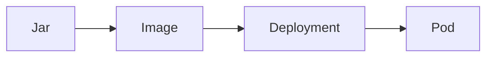

# Deploy the Spring service

Kubernetes · 25 min

The Java image runs as a Deployment. That is the first cluster milestone after Compose.

## Flow



## Deploy the Spring service

One replica first. An environment variable for the database URL, from a Secret. A port that matches the app. If it CrashLoops, read the previous logs before you change the manifest. Do not deploy the agent in the same step.

## Play this

1. Name it
2. Say the rule
3. Tie it to the project or a problem
4. One sentence from memory tomorrow

## Steps

- Read the rule once.
- Write the example from a blank file.
- Say the interview answer out loud.

## Example

```text
image pin, one replica, env from a Secret
```

## The usual miss

A Deployment that also tries to run Kafka and Postgres in the same container.

## They will ask

What do you read when the pod restarts?

## Before you close the laptop

Run one replica locally in the cluster.
