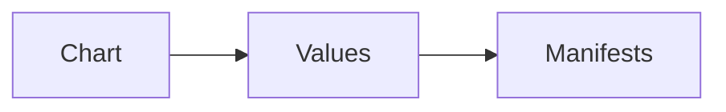

# Helm

Kubernetes · 15 min

Helm templates the manifests so the laptop and the cluster differ by values.

## Flow



## Helm

One chart, two values files. Image tag and replica count are values. You do not copy YAML and drift. Helm is after the raw manifests work. CKAD may ask you to edit a manifest by hand, so you still know the YAML.

## Play this

1. Name it
2. Say the rule
3. Tie it to the project or a problem
4. One sentence from memory tomorrow

## Steps

- Read the rule once.
- Write the example from a blank file.
- Say the interview answer out loud.

## Example

```text
values: image tag and replicas
```

## The usual miss

Helm before a single Deployment runs.

## They will ask

What is a value, not a template?

## Before you close the laptop

Move the image tag into values.
