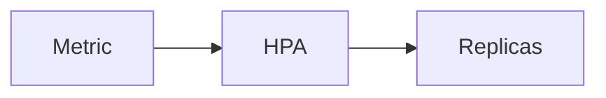

# HPA

Kubernetes · 15 min

The Horizontal Pod Autoscaler adds pods from a metric.

## Flow



## HPA

CPU is a start for the API. Lag is the right metric for a consumer, if you can expose it. Set a max so a bug cannot scale to the ceiling. Min 1 for a demo. The metric must exist before the HPA does, or it will sit idle and you will think scaling works.

## Play this

1. Name it
2. Say the rule
3. Tie it to the project or a problem
4. One sentence from memory tomorrow

## Steps

- Read the rule once.
- Write the example from a blank file.
- Say the interview answer out loud.

## Example

```text
min 1, max 3, CPU 70 for the API
```

## The usual miss

An HPA on a metric you never emit.

## They will ask

What adds a consumer?

## Before you close the laptop

Write min, max, and the signal.
