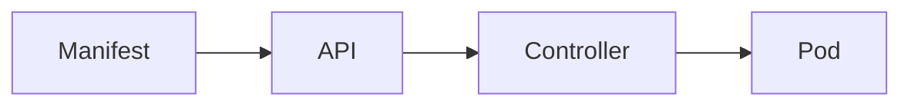

# Kubernetes fundamentals

Kubernetes · 20 min

A cluster runs containers from a desired state. You declare the state. Controllers try to make it true.

## Flow



## Kubernetes fundamentals

You need the words: pod, node, namespace, label, selector. A pod is the running unit. A label is how a Service finds it. Everything else in this list is a kind of desired state. You already see the same ideas on OpenShift.

## Play this

1. Name it
2. Say the rule
3. Tie it to the project or a problem
4. One sentence from memory tomorrow

## Steps

- Read the rule once.
- Write the example from a blank file.
- Say the interview answer out loud.

## Example

```text
label app=api, selector app=api
```

## The usual miss

Editing a running container and expecting it to last.

## They will ask

What finds the pods for a Service?

## Before you close the laptop

Draw pod, Service, selector.
