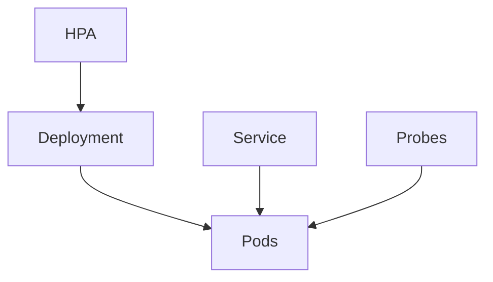

# Deployment, Service, probes, HPA

Kubernetes · 40 min

CKAD is a hands-on exam and it is relevant later. It is not how you learn. These objects are how you learn.

## Flow



## Play this

1. Deployment keeps N pods
2. Service is the stable address
3. Readiness is traffic
4. Liveness is restart

## Steps

- Deployment declares the desired count and the image.
- Service selects pods by label. Ingress or a load balancer is the door from outside.
- Readiness false means leave me alone. Liveness false means restart me. Mixing them up causes outages.
- HPA scales on CPU or a custom metric. It does not fix a memory leak.

## Example

```text
CKAD order: Docker, these objects, ConfigMap and Secret, RBAC, volumes, Helm, then the exam.
```

## The usual miss

Using liveness to check a downstream dependency, so a database blip restarts every pod.

## They will ask

Why did this pod restart, and why did it stop receiving traffic?

## Before you close the laptop

Write a Deployment and a Service for the FastAPI chunk service. Apply it locally if you have a cluster, or kind.
