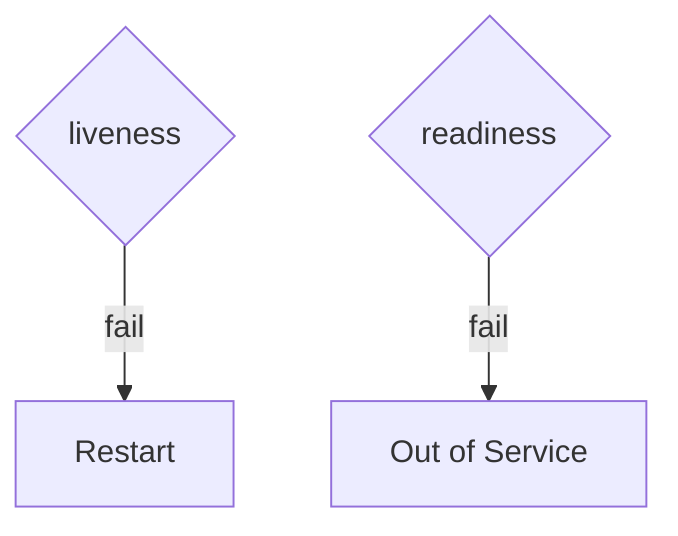

# Probes

Kubernetes · 20 min

Liveness restarts a stuck process. Readiness removes it from the Service.

## Flow



## Probes

Liveness is the process. Readiness includes the database for the API. A failing database should not restart every pod in a loop. initialDelaySeconds long enough for the JVM. The agent's readiness is its own /health, not the Java database.

## Play this

1. Name it
2. Say the rule
3. Tie it to the project or a problem
4. One sentence from memory tomorrow

## Steps

- Read the rule once.
- Write the example from a blank file.
- Say the interview answer out loud.

## Example

```text
liveness /health, readiness /ready with the database
```

## The usual miss

One probe for both, pointed at the database.

## They will ask

Which failure should restart the pod?

## Before you close the laptop

Set both paths.
