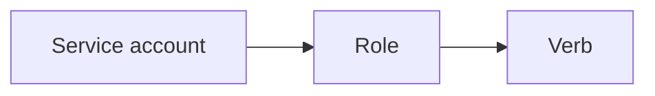

# RBAC

Kubernetes · 15 min

The agent service account can read what it must and cannot delete the namespace.

## Flow



## RBAC

A Role in the namespace. Verbs get, list on the resources you chose. The executor's account is separate and unused until approval exists. kubectl auth can-i is how you check. This is the same idea as the IAM role.

## Play this

1. Name it
2. Say the rule
3. Tie it to the project or a problem
4. One sentence from memory tomorrow

## Steps

- Read the rule once.
- Write the example from a blank file.
- Say the interview answer out loud.

## Example

```text
agent: get metrics. executor: a different account.
```

## The usual miss

cluster-admin on the agent.

## They will ask

What can the agent service account do?

## Before you close the laptop

Write two verbs.
