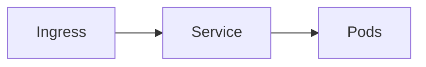

# Service and Ingress

Kubernetes · 20 min

A Service is a stable name and a load balancer across pods. An Ingress is HTTP routing from outside.

## Flow



## Service and Ingress

ClusterIP for Java, so only the cluster can call it. The agent uses that name. An Ingress or a LoadBalancer in front of the API if you must reach it from your laptop. The selector must match the pod labels. targetPort is the container port.

## Play this

1. Name it
2. Say the rule
3. Tie it to the project or a problem
4. One sentence from memory tomorrow

## Steps

- Read the rule once.
- Write the example from a blank file.
- Say the interview answer out loud.

## Example

```text
Service api, port 8080, selector app=api
```

## The usual miss

An Ingress before the Service exists, or a selector typo.

## They will ask

Why can the agent use a short name?

## Before you close the laptop

Write the selector and the port.
