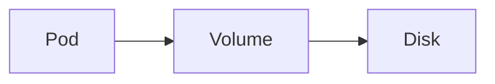

# Volumes

Kubernetes · 10 min

A volume is a disk or a mounted file that outlives the container filesystem.

## Flow



## Volumes

The API does not need a volume if bytes live in object storage and metadata lives in Postgres. A scratch emptyDir is enough for a temporary file. A database on a pod volume is not the design. Say no volume for the app and mean it.

## Play this

1. Name it
2. Say the rule
3. Tie it to the project or a problem
4. One sentence from memory tomorrow

## Steps

- Read the rule once.
- Write the example from a blank file.
- Say the interview answer out loud.

## Example

```text
no volume on the API. Postgres is a separate data store.
```

## The usual miss

A Deployment with a hostPath database.

## They will ask

Why does the API pod have no volume?

## Before you close the laptop

Write 'no' and the reason.
