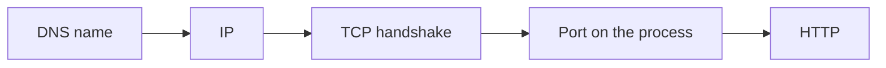

# Processes, DNS, and TCP

Linux · 30 min

Cloud and Kubernetes debugging is Linux with extra YAML. You need to tell a refused connection from a timeout, and a process from a container.

## Flow



## The three errors

Connection refused means the SYN reached a host and no socket accepted it. The process is down, or you used the wrong port. Timeout means packets vanished: security group, NACL, network policy, a route, or a firewall. Name or service not known means DNS. Read the error before you change a manifest. In Kubernetes, the Service's targetPort must match the container port, and the pod's labels must match the Service selector.

## What you run

Inside a debug container or on the laptop: curl, dig or getent hosts, ss, and the application log. On AWS, the security group is a stateful firewall on the instance. The VPC route table must have a path. Say those two names when a cloud deploy times out. You do not need to become a kernel engineer before the switch.

## Play this

1. Connection refused: nothing listens
2. Timeout: a filter or a route dropped you
3. DNS failure: the name never became an IP
4. A container has its own network namespace

## Steps

- A process has a pid, file descriptors, and ports. A container is a process with namespaces. A pod is one or more containers that share a network namespace.
- curl -v shows DNS, the TCP connect, and the HTTP status. ss -lntp shows who listens.
- HTTP keep-alive reuses the TCP connection. A load balancer idle timeout that is shorter than the client's is a classic stuck-connection bug.

## Example

```text
curl -v http://127.0.0.1:8080/health
# refused: the process is down
# timeout: security group, network policy, or the wrong subnet
# 500: the process is up and the bug is in the app
```

## The usual miss

Restarting the pod before you know whether the port is open.

## They will ask

The service exists and the pod is Running. The client times out. Where do you look?

## Before you close the laptop

Break the project on purpose: stop Postgres and write down the exact client error.
