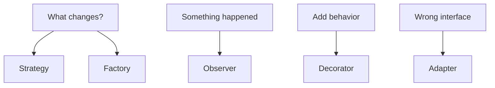

# LLD: classes, SOLID, and five patterns

LLD · 45 min

HLD picks the boxes. LLD picks the classes inside one box. SDE II loops ask for both. You already use these patterns inside Spring. Name them.

## Flow



## How to run the 45 minutes

Clarify the operations, not every future feature. Parking lot: park, unpark, find a spot. Rate limiter: allow or deny for a key. Name the entities, the relationships, and the one method that can go wrong under two threads. Then write that method. Mention the lock or the atomic only where the shared state lives.

## The five patterns you will actually use

Strategy: the limit algorithm is TokenBucket or SlidingWindow, chosen at construction. Factory: building a notifier for email or push without a switch in the caller. Observer: an object event notifies the audit log and the agent. Decorator: timing or retries wrap a repository. Adapter: the Python agent speaks HTTP, the Java client speaks your interface. Singleton is usually the wrong answer. Spring already scopes beans.

## A shape that interviews accept

RateLimiter depends on a Clock and a Store. Store is in-memory for the interview and Redis in production. Clock is injectable so a test can move time. allow(key) reads the bucket, refills from elapsed time, and decrements. The store update is atomic. Say what happens when Redis is down: fail open or fail closed, and why you picked it.

## Play this

1. One reason to change per class
2. Strategy when the algorithm changes
3. Factory when construction is messy
4. Observer when others must hear an event

## Steps

- SOLID in one line each. Single responsibility: one reason to change. Open/closed: new behavior by new code. Liskov: a subtype can stand in. Interface segregation: small interfaces. Dependency inversion: depend on the interface the caller owns.
- In a 45-minute LLD, spend 10 minutes on the nouns and the operations, 25 on classes and the one tricky method, 10 on concurrency or failure.
- Prefer composition. A class that implements five interfaces is usually three classes.

## Example

```text
interface RateLimit {
    boolean allow(String client);
}
class TokenBucket implements RateLimit {
    public boolean allow(String client) { return true; }
}
class Limiter {
    private final RateLimit policy;
    Limiter(RateLimit policy) { this.policy = policy; }
}
```

## The usual miss

Drawing a UML poster and never writing the method that races.

## They will ask

Design a rate limiter. Which class owns the counters?

## Before you close the laptop

Write the four class names for a token bucket and the one method that must be atomic.
