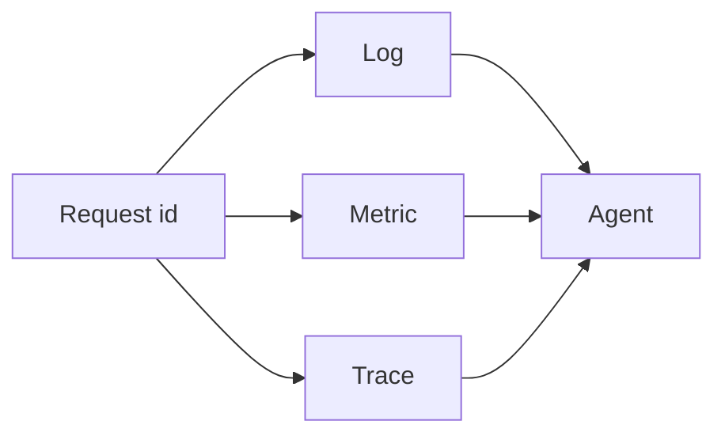

# Logs, metrics, traces

Observability · 30 min

Reliability work is how you notice the bucket latency before the user writes the ticket. The diagnostics agent reads the same three signals.

## Flow



## How you debug with the three

Start with the metric: is error rate or latency up, and since when? Pick one slow request id from the log. Open its trace. The widest span is the suspect. Then read the log lines for that id only. This is also the diagnostics agent's procedure. If you can do it by hand, you can tell the agent to do it and then check the citation.

## What you page a human for

Page on user-visible failure and on a disk or error budget that will run out. Do not page on a single log line. The capacity agent forecasts the 80 percent mark so the page happens before the cluster is full. Actuator on Spring exposes health and metrics. CloudWatch or Prometheus scrapes them. The tool is secondary to the three signals.

## Play this

1. One correlation id
2. RED: rate, errors, duration
3. A log is an event, not a novel
4. An alert needs an action

## Steps

- Logs: structured, with the request id and the bucket id. High-cardinality data stays out of metric labels.
- Metrics: request rate, error rate, latency histogram. A gauge for disk used. Alert on the symptom the user feels, and on saturation before the disk fills.
- Traces: spans across the API, the database, and the agent tool call. The trace is how you prove the latency is in the database and not in the model.

## Example

```text
requestId=9f2c bucketId=b1 latencyMs=840 dbMs=790
The story is the database, not the model.
```

## The usual miss

Logging the entire object on every request and calling it observability.

## They will ask

Latency is high. Which signal do you open first, and what would change your mind?

## Before you close the laptop

Put a request id on the project API log line and on the Kafka event.
