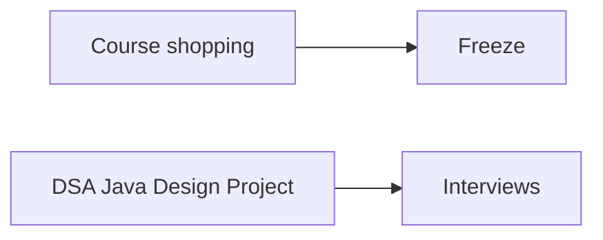

# What stays closed until the offer

Path · 10 min

The failure mode is a stack of courses and no interviews. React, deep learning research, ten frameworks, CKA plus CKAD together, KMP as a lifestyle, and random hards do not move a Java SDE II loop.

## Flow




## Play this

1. Close the extra tabs
2. One project
3. Two credentials later
4. January is for applications

## Steps

- Skip AWS Cloud Practitioner. It is aimed at people new to cloud.
- Skip AI-900. The current fundamentals exam people mean is AI-901, and even that is optional next to a RAG project.
- Skip LangChain certificates, Python completion badges, and a Docker beginner badge.

## Example

```text
Do: AWS Solutions Architect Associate after you can draw a VPC. CKAD after you have deployed the project. AWS Generative AI Developer Professional only after the agents are real.
```

## The usual miss

Buying the next Udemy bundle because the last one felt unfinished.

## They will ask

Name three things you will not study before January.

## Before you close the laptop

Write the skip list on paper and leave it in the laptop sleeve.
