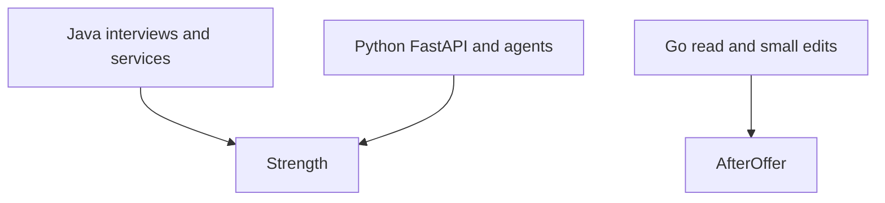

# Java primary, Python secondary, Go later

Path · 20 min

Postings are polyglot. Google India lists Java, Go, or Python. Apple Bengaluru pairs Spring with Kubernetes, Kafka, and Go or Python. Salesforce and Cisco do the same. Java is not dying in your target set. You already have the production years.

## Flow



## Play this

1. Solve DSA in Java
2. Write the agent API in Python
3. Read one Go file a week after December
4. Do not split practice three ways

## Steps

- Every blank rewrite this month is Java.
- Python starts with the types and tests the flagship service needs, not a 40-hour syntax course.
- Go becomes a weekend reader in 2027: a small HTTP handler, goroutines at a conceptual level, and the storage-service style Apple posts describe.

## Example

```text
// Java stays the interview language
CompletableFuture<Report> report = diagnostics.collect(bucket);
```

## The usual miss

Being slightly able to start a main method in three languages and fluent in none.

## They will ask

Which language do you code the medium in?

## Before you close the laptop

Open one old PR and explain one CompletableFuture you wrote, without the IDE.
