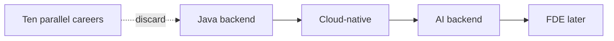

# One profile, not ten careers

Path · 20 min

You are a Dell SDE II with 3+ years, Java, Spring Boot, microservices, Kafka, async work, Kubernetes/OpenShift, Docker, and already-shipped agent and RAG work. The switch is interview depth on that base, plus Python and AWS practiced on one project. You are not restarting as an AI fresher.

## Flow



## Play this

1. Keep the Dell and TCS backend story
2. Add Python only where the agent project needs it
3. Treat Go as reading ability
4. Apply as a backend engineer who ships AI

## Steps

- Write one sentence you can say in an interview: Senior backend engineer, Java and Spring, distributed systems, with production-style RAG and agents.
- Put FDE in a second folder. Do not make it the January application identity.
- Do not describe Dell proprietary data or internal source in a public repo. Rebuild the shape with synthetic metrics.

## Example

```text
Primary: Java
Secondary: Python
Tertiary: Go, enough to read a service and change a handler
```

## The usual miss

Throwing away three years to become a LangChain beginner.

## They will ask

Walk me through the profile you want in April 2027.

## Before you close the laptop

Say the one-sentence profile out loud once. Pin it at the top of the desk.
