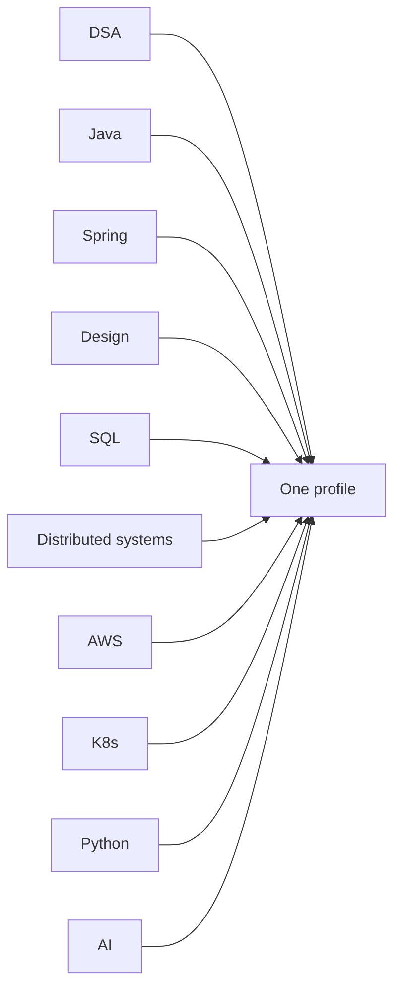

# Every skill in the target stack, with a slot

Path · 25 min

The job posts share one stack. Each row below has a weight, a phase, and a lesson in this guide. Nothing in the stack is a separate career.

## Flow



## DSA — very high

Phase 1 through January. About 40 patterns and 120 to 150 problems, five passes. The DSA section of this guide is the set: recognition, a Java template, and the representative problems. January stops at basic DP. MCM, trie, KMP, and Kosaraju wait.

## Java — very high

You already write it. The gap is interview depth: HashMap, collections choice, equals and hashCode, streams, generics, immutability, executors, CompletableFuture, volatile, locks, and a plain JVM story. Lessons are in the Java section. Say them from the Dell async work, with a failure mode.

## Spring Boot — very high

IoC and the proxy, transactions and propagation, JPA and N+1, REST with validation and a single error shape, Kafka with crash and idempotency, outbox, Redis, security, resilience, tests, actuator. The 45-minute block in phase 2 is this list, one topic a day.

## System design HLD — very high

Same checklist every time: requirements, scale, API, data model, architecture, database, cache, queue, consistency, failure, observability, security, trade-off. Phase 2 owns URL shortener, rate limiter, notification, file storage. Phase 4 owns five to eight full designs, including cache, chat, feed, search, payments, scheduler, logs, and the RAG agent.

## LLD, OOP, and design patterns — very high

A 45-minute class design shows up next to HLD in SDE II loops. You need SOLID in one sentence each, and Strategy, Factory, Observer, Decorator, Adapter as tools you pick, not a poster. The LLD lesson is a rate limiter drawn as classes.

## Distributed systems — very high

This is the language of your Kafka and storage work: replication, partitions, timeouts, retries, idempotency, ordering, and what a crash repeats. The distributed-systems lesson is the theory. The Kafka lessons are the concrete system.

## SQL and database internals — very high

Indexes, EXPLAIN, isolation, MVCC, and deadlocks. JPA is how you meet the database. The SQL lesson is what the database is doing under the repository.

## AWS — very high

Solutions Architect Associate level, not Cloud Practitioner. IAM and VPC first, then EC2, ALB, autoscaling, S3, RDS, DynamoDB, ElastiCache, SQS, SNS, Lambda, ECS, EKS, CloudWatch, CloudTrail, API Gateway, ECR, Secrets Manager, KMS, Route 53. Phase 3. Then deploy the project: EKS, S3, RDS, ElastiCache, SQS, CloudWatch, IAM.

## Docker and Kubernetes — high

Order is fixed: image on the laptop, Deployment, Service, probes, HPA, ConfigMap, Secret, RBAC, volumes, Helm, then CKAD. CKAD does not replace that order. You already touch OpenShift. The public proof is the same objects on the flagship.

## Kafka — high

Why a log instead of REST, delivery, consumer crash, duplicates, ordering, retry, DLQ, outbox. Phase 2, and the project publishes object events through the outbox by 25 November.

## Redis — high

Cache, rate-limit counter, and short-lived agent session. Not the source of truth. Eviction and a stampede belong in the same answer.

## Linux and networking — high

Enough to debug a pod and an API: process, port, DNS, TCP timeout versus connection refused, HTTP, and the commands you actually run. One lesson, used every time a deploy fails.

## Observability and reliability — high

Logs, metrics, traces, a correlation id, and one alert that a human can act on. The diagnostics agent is this skill with a model in front of it.

## Python — secondary, start now

Phase 1 is syntax, collections, functions, OOP, venv, pip, typing, requests. Then pytest, httpx, asyncio, FastAPI, Pydantic, SQLAlchemy, Docker. You are building the agent service, not collecting a Python certificate.

## Go — tertiary

Apple storage and Cisco distributed roles mention Go beside Java. Read it. Write a small main after the offer. Do not pause Java to become a beginner in three languages.

## GenAI, RAG, agents, MCP, evals — the differentiator

Phase 3: tokens, embeddings, chunking, retrieval, rerank, citations, tool calling, FastAPI. Phase 4: the four agents, human approval, traces, and an eval score in the README. MCP is how a tool is exposed. It is not a personality.

## Terraform, certificates, LinkedIn, BITS

Terraform is one module that describes the network you already drew. Certificates are SAA, then CKAD, then a GenAI professional exam when the project is real. AI-901 and AWS AI Practitioner are optional. LinkedIn is one technical post a week and a short list of people. BITS M.Tech AI and ML is a parallel degree if the batch, fee, and hours fit. It does not sit in the January plan.

## Play this

1. Very high skills are the interview
2. High skills are the project
3. Go and certificates support
4. One profile receives all of it

## Steps

- Very high, January: DSA, Java, Spring, HLD, LLD, distributed systems, SQL, AWS, Kafka, GenAI on the project.
- High: Docker, Kubernetes, Redis, Linux and networking, observability. They are practiced by deploying the same project.
- Secondary: Python from phase 1. Go is read-only until after the offer. Terraform is one module, not a course.
- Supporting: SAA after you can draw a VPC, CKAD after you can debug a pod, LinkedIn once a week. BITS is parallel and does not replace this list.

## Example

```text
DSA                         20%   weekday 75 min, Patterns tab
Java + Spring               20%   weekday 45 min
System design               20%   Saturday 2 hours
Cloud + K8s + Docker        15%   weekday 30 min, then the project
Python + GenAI              15%   same 30 min block, phases 1 then 3
Project                      5%   threaded: Kafka, Redis, K8s, AWS land here
Certificates                 5%   SAA, later CKAD, later GenAI professional
```

## The usual miss

Studying the list top to bottom as twelve courses.

## They will ask

Which three skills are you weak at, and which phase owns them?

## Before you close the laptop

Write the three weak skills on a card. They are the only 30-minute blocks this week.
