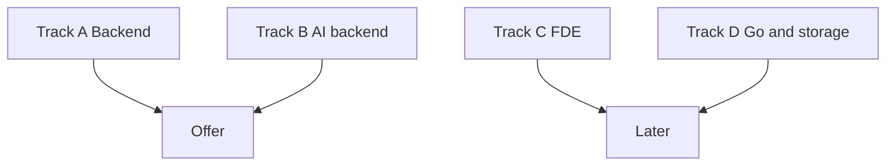

# Four tracks, one weight

Path · 15 min

Track A is the job you apply for. Track B is the differentiator already started at Dell. Track C is FDE if a posting fits. Track D is Go and storage infrastructure later, which matches object-storage work, not this winter.

## Flow



## Play this

1. Backend loop pays the 40-50 target
2. AI work makes the resume specific
3. FDE needs customer discovery
4. Go waits until after the offer

## Steps

- January applications: backend and AI-platform roles, SDE II / SWE III / senior only where the years match.
- One FDE application is allowed after the flagship README can explain a safe tool call. It is not the whole pipeline.

## Example

```text
Atlassian remote-India roles and some India FDE posts exist. US-level pay for India WFH is not the default. Comp follows entity, level, and geo.
```

## The usual miss

Applying only to FDE titles because the tweets are loud.

## They will ask

Which track gets 70 percent of this week?

## Before you close the laptop

Mark Track A and Track B as the only open tabs this month.
