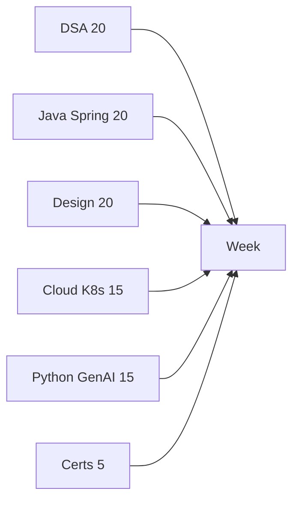

# Where the hours go

Path · 10 min

About 19 to 20 hours a week. DSA, Java/Spring, and system design take 20 percent each. Cloud and Kubernetes 15. Python and GenAI 15. The project is threaded through those hours, not a fifth full-time job. Certificates are 5 percent.

## Flow



## Play this

1. 75 minutes DSA on weekdays
2. 45 minutes backend or design
3. 30 minutes Python, AI, or cloud
4. Saturday is the long build

## Steps

- Weekday total is 2.5 hours, then stop.
- Saturday: 2 hours DSA, 2 hours design, 2 hours project.
- Sunday: 1.5 hours retrieval, 2 hours project, 1 hour Java or a mock.

## Example

```text
A weekday that becomes six hours dies by Wednesday. The cap is the method.
```

## The usual miss

Adding a night session because the morning felt short.

## They will ask

What do you stop doing at minute 150 on a Wednesday?

## Before you close the laptop

Set a repeating timer for 75, 45, and 30. When it rings, stand up.
