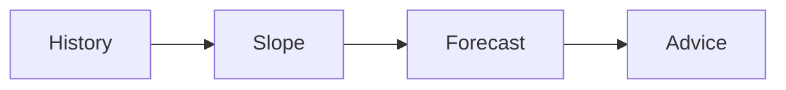

# Capacity agent

Project · 30 min

The second agent forecasts whether a cluster crosses a threshold. It is a query and a sentence, not a research model.

## Flow



## The forecast you can defend

Read used bytes over time. Fit a simple trend. State the assumption: the last seven days continue. Answer whether the series crosses 80 percent inside the horizon. Recommend a scale step. A fake history in the repo is enough. A learned model is not required. The interview line is the assumption, not the library.

## Play this

1. Use the stored series
2. State the assumption
3. Recommend, do not resize
4. Show the date it crosses

## Steps

- A linear or seasonal baseline is enough. Say the assumption.
- The tool returns the series. The model writes the sentence. The number comes from your code, not from the model’s imagination.
- If the series is shorter than two weeks, the agent says the forecast is weak.

## Example

```text
At the current slope, 80 percent full on day 40. Assumption: no new tenant.
```

## The usual miss

Letting the model invent the percentage.

## They will ask

Where is the number computed?

## Before you close the laptop

Implement the forecast in plain code. The model only explains it.
