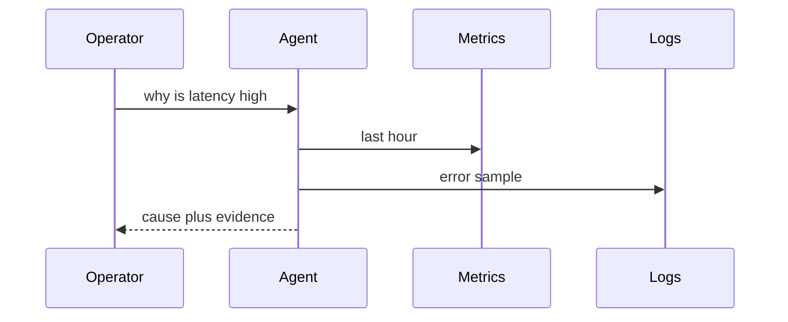

# Diagnostics agent

Project · 40 min

The first agent answers a latency question by reading metrics, logs, and traces, then naming a likely cause with the evidence attached.

## Flow



## The procedure

Question: why is bucket latency high? Collect the latency metric, the slow request ids, the traces, and the recent error logs. Correlate on bucket id and time. Name a likely cause and the evidence. Recommend an action. Do not take the action. If the evidence is thin, say so. The eval asks for the evidence ids, not for a poetic root cause.

## Play this

1. Read tools only
2. Correlate time
3. Cite the series
4. Refuse if evidence is thin

## Steps

- Tools: getLatency, getErrorRate, getRecentLogs. All read-only.
- The answer template: observation, likely cause, what would disprove it.
- Eval: ten scripted incidents with an expected cause label.

## Example

```text
Cause: retry storm. Evidence: error rate up, then latency up, same minute.
```

## The usual miss

A confident cause with no series id.

## They will ask

What would make you discard this hypothesis?

## Before you close the laptop

Seed three fake incidents and write the expected labels.
