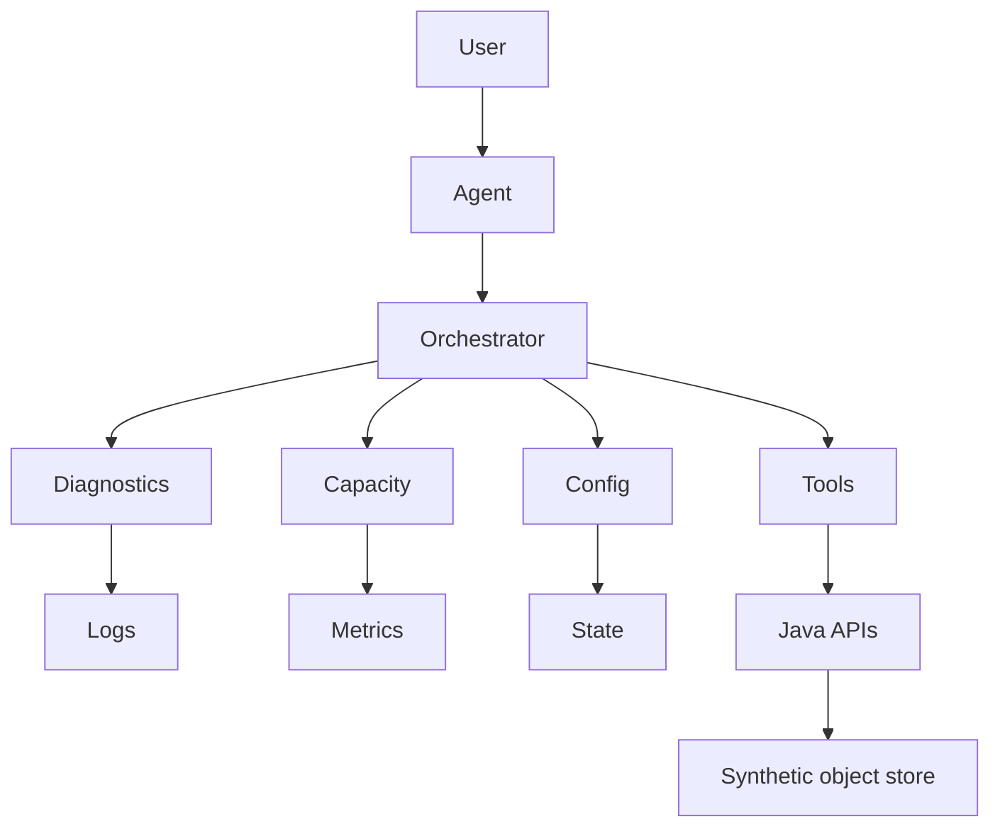

# AI-native object storage operations

Project · 45 min

One project replaces the certificate pile. It is an operations console for a fake object store: Java services own metadata and events, a Python agent reads them, and a human approves anything that changes the cluster.

## Flow



## Play this

1. Synthetic data only
2. Java owns the system of record
3. Python owns the agent loop
4. Writes wait for a human

## Steps

- Do not copy Dell code, schemas, hostnames, or customer data. Invent buckets, latency series, and runbooks.
- Services: metadata API in Spring Boot, event outbox, a worker, Postgres, Redis for the rate limit and session.
- The README has a diagram, how to run it, and an eval score.

## Example

```text
Question the demo must answer: why is bucket latency high, using only the synthetic series.
```

## The usual miss

A chat box with no tools and no score.

## They will ask

What can the agent do without a person, and what can it not?

## Before you close the laptop

Create the repo and the architecture page. No model call yet.
