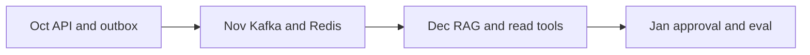

# Milestones through January

Project · 15 min

The project grows with the phases. It is not a December surprise.

## Flow



## Play this

1. October is the Java spine
2. November adds the bus and cache
3. December adds retrieval
4. January adds the gate and the score

## Steps

- By 25 Oct: Spring service, Postgres, one idempotent POST, README run steps.
- By 25 Nov: outbox, a consumer, Redis rate limit, Docker compose.
- By 20 Dec: FastAPI retrieval over the fake postmortems, ten eval questions.
- By 15 Jan: approval gate, twenty eval questions, a number in the README, a diagram you can redraw.

## Example

```text
Deploy to Kubernetes when compose is boring. AWS labels on the diagram can wait until the objects exist locally.
```

## The usual miss

A Kubernetes cluster in October with no API.

## They will ask

What is true in the repo on 25 November?

## Before you close the laptop

Put the four dates in the README now, unchecked.
