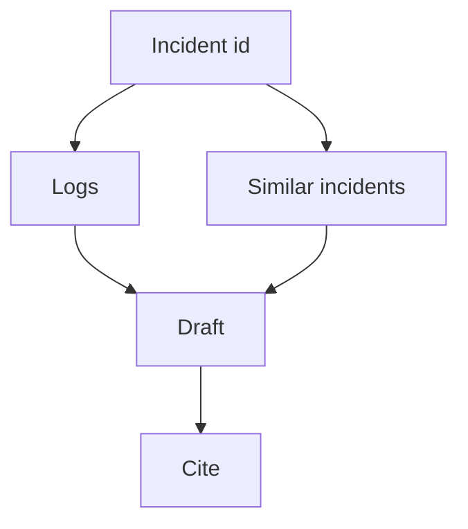

# Incident RCA with retrieval

Project · 40 min

The third agent takes an incident id, pulls logs, and retrieves similar synthetic incidents and postmortems. That is RAG with a job to do.

## Flow



## Retrieval with a job

Input is an incident id. Load its logs. Retrieve similar synthetic incidents and postmortems. Answer with a suspected cause, a fix, and the ids you used. A missing citation fails the eval. Similar PRs, if you include them, are public or synthetic patches, not internal diffs.

## Play this

1. Fetch by id
2. Retrieve similar text
3. Draft with citations
4. No fix is applied

## Steps

- The corpus is synthetic postmortems you write. Twenty is enough.
- Similar means embedding or keyword overlap. Record which you used.
- The output is a draft for a human. It is not a merged pull request.

## Example

```text
Similar to incident 12: disk saturation. Your logs show the same queue time.
```

## The usual miss

Training a model on Dell tickets.

## They will ask

What is in the corpus, and what is forbidden to be in it?

## Before you close the laptop

Write five fake postmortems. They are the index.
