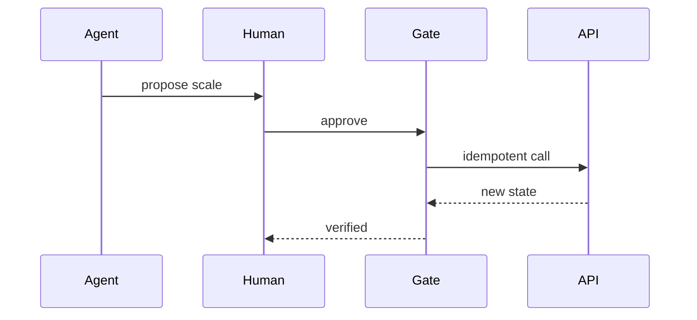

# Safe executor

Project · 35 min

The fourth piece is the gate. The agent proposes. A person approves. A tool runs. A check verifies. The trace is the audit.

## Flow



## The gate

The model proposes a tool call. The API stores the proposal as pending. A person approves. The executor runs the allow-listed tool with a timeout and an idempotency key. A verifier reads the metric or the config and records whether the change happened. A second approval does not double-apply. Denial is a recorded state. This is the January milestone.

## Play this

1. Proposal is data
2. Approval is a record
3. Tool is allow-listed
4. Verify after

## Steps

- The proposal is a JSON document: action, target, reason, evidence ids.
- Approve stores the user id. The Java API checks that row before it mutates.
- Idempotency key so a double click does not scale twice.
- Verification reads the new state and attaches it to the trace.

## Example

```text
POST /actions with Idempotency-Key. 200 on replay returns the same result.
```

## The usual miss

The model calling kubectl with a string it composed.

## They will ask

Who is allowed to approve, and where is that enforced?

## Before you close the laptop

Implement the approval table in Java before the agent can ask for it.
