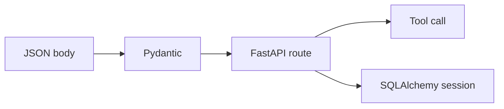

# FastAPI, Pydantic, SQLAlchemy

Python · 40 min

The agent service is a small Python web app. This is phase 3, after you can call HTTP from a script.

## Flow



## The shape of the service

FastAPI gives you HTTP and documentation. Pydantic gives you types at the boundary. SQLAlchemy is only there if the agent reads Postgres itself. It can also call the Java API and stay free of a second schema. Prefer calling Java for writes. Python may read for retrieval. Two writers to the same tables will produce a bug you will have to explain in the interview.

## Async and tests

httpx.AsyncClient is worth async. A CPU-bound loop is not. pytest with TestClient calls the route in-process. The fake model returns a fixed answer so the test checks that evidence ids are passed through. That test is part of the eval story.

## Play this

1. Pydantic validates the body
2. The route stays thin
3. A session opens and closes
4. pytest hits the route

## Steps

- A Pydantic model is the request and the response. Validation errors return 422.
- The route calls a function. The function calls tools. The route does not embed a prompt the size of a file.
- SQLAlchemy session is a unit of work. Close it. Do not keep a global session.
- Async is for the HTTP client that is async. Do not mark every function async out of habit.

## Example

```text
@app.post("/diagnose")
def diagnose(body: Question) -> Answer:
    evidence = tools.metrics(body.bucket_id)
    return Answer(text=draft(evidence), evidence=evidence)
```

## The usual miss

A route that opens a model client, a database, and a prompt, all inline.

## They will ask

Where is the prompt, and how do you test the route without paying for a model?

## Before you close the laptop

Add the diagnose route with a fake model and one pytest.
