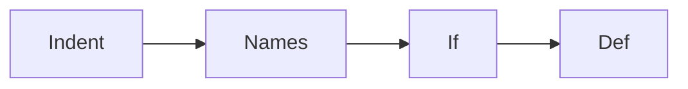

# Python basics

Python · 30 min

Phase 1, first 30-minute blocks. Syntax you can read without translating every token from Java.

## Flow



## Python basics

Indentation is the block. None is not an object you can call. True and False are capitalized. 7 / 2 is 3.5 and 7 // 2 is 3. A script ends with the main guard so a test can import it. Comments do not make a type. Run the file. That is the lesson.

## Play this

1. Name it
2. Say the rule
3. Tie it to the project or a problem
4. One sentence from memory tomorrow

## Steps

- Read the rule once.
- Write the example from a blank file.
- Say the interview answer out loud.

## Example

```text
if __name__ == '__main__': main()
```

## The usual miss

Copying braces and wondering why the indent failed.

## They will ask

What is 7 / 2?

## Before you close the laptop

Run a ten-line file that prints a bucket id.
