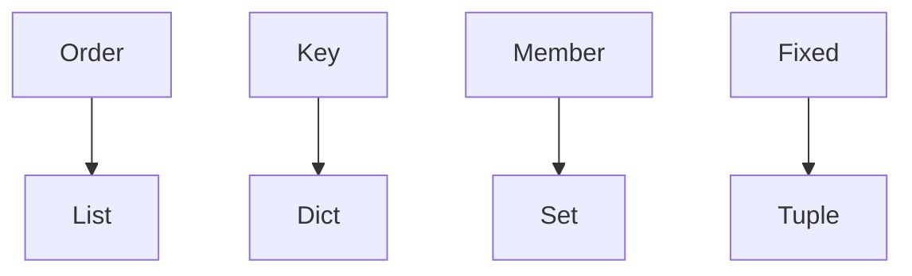

# Python collections

Python · 20 min

list, dict, set, tuple. Pick the one the operation needs.

## Flow



## Python collections

A list is ordered and allows duplicates. A dict maps a key and keeps insertion order. A set is membership. A tuple is a fixed record and can be a dict key if its contents are hashable. A list as a default argument is shared across calls. Use None and create the list inside.

## Play this

1. Name it
2. Say the rule
3. Tie it to the project or a problem
4. One sentence from memory tomorrow

## Steps

- Read the rule once.
- Write the example from a blank file.
- Say the interview answer out loud.

## Example

```text
def add(item, sink=None):
    sink = [] if sink is None else sink
```

## The usual miss

def f(items=[]):

## They will ask

Which type is membership?

## Before you close the laptop

Rewrite one Java map as a dict.
