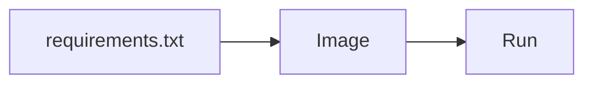

# Docker for the agent

Python · 20 min

The image runs the same venv you tested. It is the last Python step before Kubernetes.

## Flow



## Docker for the agent

A small base image. Copy requirements first so the install caches. Do not run as root if you can avoid it. The port matches the Service. Compose starts this image next to the Java image, Postgres, Kafka, and Redis. If the container cannot reach Java by the compose name, fix the URL. Do not special-case localhost in code that runs in the cluster.

## Play this

1. Name it
2. Say the rule
3. Tie it to the project or a problem
4. One sentence from memory tomorrow

## Steps

- Read the rule once.
- Write the example from a blank file.
- Say the interview answer out loud.

## Example

```text
CMD the uvicorn or the module you already run locally
```

## The usual miss

A Dockerfile that installs compilers and copies your home directory.

## They will ask

What is copied in, and what is not?

## Before you close the laptop

Add the agent service to Compose.
