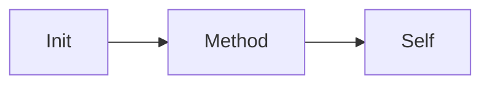

# Python classes

Python · 20 min

A class when you have state. A function when you do not.

## Flow



## Python classes

self is explicit. __init__ builds the instance. A dataclass is the record. Inheritance is rare here. The tool result is a dataclass. The diagnose function can stay a function. You are not building a framework.

## Play this

1. Name it
2. Say the rule
3. Tie it to the project or a problem
4. One sentence from memory tomorrow

## Steps

- Read the rule once.
- Write the example from a blank file.
- Say the interview answer out loud.

## Example

```text
@dataclass
class Answer:
    text: str
    evidence: list[str]
```

## The usual miss

A class with one method that should have been a function.

## They will ask

When do you skip the class?

## Before you close the laptop

Write the Answer dataclass.
