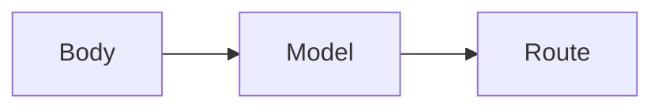

# Pydantic

Python · 20 min

Pydantic is the boundary. A bad body is 422 before your code runs.

## Flow



## Pydantic

A model for the question and a model for the answer. Evidence is a list of strings, required. An extra field can be forbidden. Defaults belong here when they are part of the contract. This replaces a pile of if body is None checks.

## Play this

1. Name it
2. Say the rule
3. Tie it to the project or a problem
4. One sentence from memory tomorrow

## Steps

- Read the rule once.
- Write the example from a blank file.
- Say the interview answer out loud.

## Example

```text
class Question(BaseModel):
    bucket_id: str
    text: str
```

## The usual miss

A dict that you hope has the key.

## They will ask

What status is a missing bucket_id?

## Before you close the laptop

Define Question and Answer.
