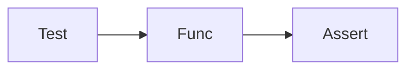

# pytest

Python · 20 min

The first test calls a function. It does not need a model bill.

## Flow



## pytest

A test is a function named test_. Assert the evidence ids, not a paragraph of prose. A fake model returns a fixed answer. pytest runs it. One test that would fail if the tool were not called is worth more than a coverage number.

## Play this

1. Name it
2. Say the rule
3. Tie it to the project or a problem
4. One sentence from memory tomorrow

## Steps

- Read the rule once.
- Write the example from a blank file.
- Say the interview answer out loud.

## Example

```text
def test_includes_metric_id():
    ans = diagnose('b1', tools=fake)
    assert 'metric-1' in ans.evidence
```

## The usual miss

Asserting the whole sentence the model might phrase two ways.

## They will ask

What do you assert?

## Before you close the laptop

Add one test with a fake tool.
