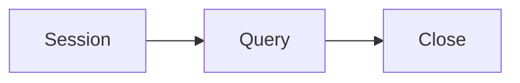

# SQLAlchemy

Python · 20 min

Use it only if Python reads Postgres itself. Prefer calling Java for writes.

## Flow



## SQLAlchemy

A session is a unit of work. Open it, use it, close it. Do not keep a global session. Models are not the Java entities copied by hand into a second source of truth. If the agent only needs a metrics endpoint, skip SQLAlchemy. If it reads incident rows for RAG, a read-only session is enough.

## Play this

1. Name it
2. Say the rule
3. Tie it to the project or a problem
4. One sentence from memory tomorrow

## Steps

- Read the rule once.
- Write the example from a blank file.
- Say the interview answer out loud.

## Example

```text
with Session(engine) as s:
    rows = s.execute(stmt).all()
```

## The usual miss

A second writer to the outbox table.

## They will ask

Who writes the business row?

## Before you close the laptop

Decide: HTTP to Java, or a read-only session. Write the decision in the README.
