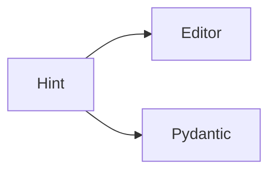

# typing

Python · 15 min

Hints are for you, the editor, and pydantic. Python does not enforce them unless you ask.

## Flow



## typing

def load(bucket_id: str) -> dict[str, int]. list[str] not List if you are on a current Python. Optional[str] is str | None. A hint does not stop a bad call at runtime. Pydantic does, at the boundary. Do not build a type cathedral. Hint the tool functions.

## Play this

1. Name it
2. Say the rule
3. Tie it to the project or a problem
4. One sentence from memory tomorrow

## Steps

- Read the rule once.
- Write the example from a blank file.
- Say the interview answer out loud.

## Example

```text
def diagnose(bucket_id: str) -> Answer:
```

## The usual miss

Hints on every local variable and no test.

## They will ask

What enforces a type at runtime here?

## Before you close the laptop

Hint the diagnose function.
