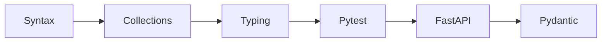

# Python through FastAPI

Python · 30 min

You do not need to become a Python developer. You need to read and write the agent service: types, tests, HTTP, and async where the HTTP library is async.

## Flow



## The sequence

Syntax, collections, functions, classes, venv, pip, typing, requests. Then pytest, httpx, asyncio where the client is async, FastAPI, Pydantic, and SQLAlchemy only if Python reads the database. Docker last in this list so the image wraps a service that already runs. The detailed lessons are Syntax and collections, and FastAPI, Pydantic, SQLAlchemy.

## Play this

1. Functions and dicts
2. Type hints
3. One pytest
4. One POST endpoint

## Steps

- venv and pip. Pin requirements. Do not install into the system Python.
- httpx or requests for the Java API. Pydantic for the body.
- SQLAlchemy only if this service owns tables. Otherwise call the Java service.
- asyncio matters when you wait on the model and the vector store together. Not before.

## Example

```text
def retrieve(question: str) -> list[str]:
    return index.search(question, k=3)
```

## The usual miss

A 40-hour syntax course before a single endpoint exists.

## They will ask

Show a typed function and a test.

## Before you close the laptop

This week's Python is one file: read three markdown runbooks and return the overlapping lines.
