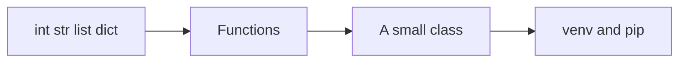

# Python syntax and collections

Python · 30 min

Phase 1, inside the 30-minute block. You need to read and write the agent without translating every line from Java in your head.

## Flow



## The differences that bite a Java developer

There is no compile step that saves you. None is not a null you can call methods on. A default argument that is a list is shared across calls. Use None and create the list inside the function. Integer division is not the Java division you remember: 7 / 2 is 3.5, 7 // 2 is 3. Imports are files. if __name__ == '__main__' is how a script stays importable.

## What phase 1 includes

Syntax, collections, functions, a class, venv, pip, typing, and requests or httpx calling your Java health endpoint. pytest comes as soon as the function exists. That is the whole month. FastAPI waits until the Java API exists to call.

## Play this

1. Indentation is syntax
2. list, dict, set
3. A function can return several values
4. venv keeps the agent separate

## Steps

- Lists are ordered. Dicts keep insertion order. Sets are for membership. A tuple is a fixed record.
- def ask(bucket: str) -> str is the shape. Type hints are for you and the tools. They are not enforced at runtime unless you add that.
- python -m venv .venv and pip install -r requirements.txt. The system Python stays alone.
- Classes exist. You do not need a class for every function. A dataclass carries a tool result.

## Example

```text
def allow(client: str, now: float) -> bool:
    bucket = buckets.get(client)
    return bucket is not None and bucket.tokens > 0
```

## The usual miss

Installing packages into the global interpreter and then wondering why the laptop and CI differ.

## They will ask

What is the difference between a list and a tuple here?

## Before you close the laptop

Create the agent folder, a venv, and a function that returns a fake diagnosis.
