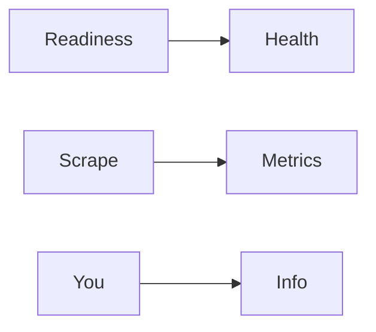

# Actuator

Spring · 15 min

Actuator is the health and metrics door. The probe uses health. You do not expose everything.

## Flow



## Actuator

Expose health and metrics. Do not expose env or heap dump on a public port. Readiness includes the database. Liveness does not, or a database blip restarts every pod. A custom health indicator checks the one dependency whose failure should remove the pod from the load balancer. Micrometer names the timers. The latency metric the diagnostics agent reads can start here.

## Play this

1. Name it
2. Say the rule
3. Tie it to the project or a problem
4. One sentence from memory tomorrow

## Steps

- Read the rule once.
- Write the example from a blank file.
- Say the interview answer out loud.

## Example

```text
management.endpoints.web.exposure.include: health,metrics
liveness: process up
readiness: database up
```

## The usual miss

A readiness check that restarts the pod when Redis blips.

## They will ask

What is the difference between liveness and readiness?

## Before you close the laptop

Write the two checks for the Java service.
