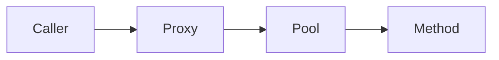

# Spring async

Spring · 15 min

@Async runs on a pool you configure. The proxy rule still applies.

## Flow



## Spring async

A self-call does not async. The method must be public on another bean. The executor is a bean with a bound queue. Return CompletableFuture if the caller needs the result. An async method that shares a lazy JPA session will fail. Pass ids, not entities. Exceptions in a void async method disappear unless you set an exception handler. The relay that publishes the outbox can be scheduled or async. It still uses its own transaction.

## Play this

1. Name it
2. Say the rule
3. Tie it to the project or a problem
4. One sentence from memory tomorrow

## Steps

- Read the rule once.
- Write the example from a blank file.
- Say the interview answer out loud.

## Example

```text
@Async("ioPool")
public CompletableFuture<Void> publish(String id)
```

## The usual miss

@Async on a private method.

## They will ask

Why did the method run on the request thread?

## Before you close the laptop

Name the pool. Bounded queue.
