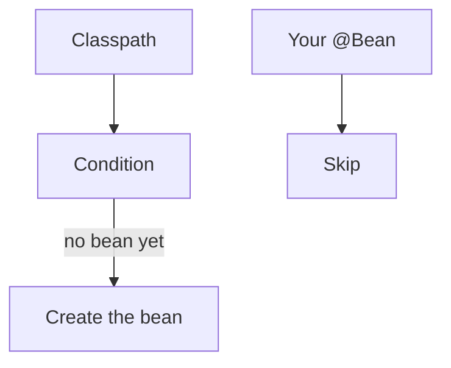

# Auto configuration

Spring · 15 min

Auto-configuration creates beans when a class is present and you did not define your own.

## Flow



## Auto configuration

Spring Boot looks at the classpath. If DataSource is absent and a JDBC driver is present, it builds one from properties. If you declare your own DataSource, yours wins. Conditions are the mechanism. You read them when a bean appears that you did not write. Exclude an auto-configuration only when you can say which bean it created and why you replaced it. The interview line: convention from the classpath, override with a bean.

## Play this

1. Name it
2. Say the rule
3. Tie it to the project or a problem
4. One sentence from memory tomorrow

## Steps

- Read the rule once.
- Write the example from a blank file.
- Say the interview answer out loud.

## Example

```text
# application.yml
spring.datasource.url: jdbc:postgresql://localhost/objects
```

## The usual miss

Excluding auto-configuration to silence an error you have not read.

## They will ask

Why did a DataSource appear without a @Bean?

## Before you close the laptop

Name the property that would point the project at Postgres.
