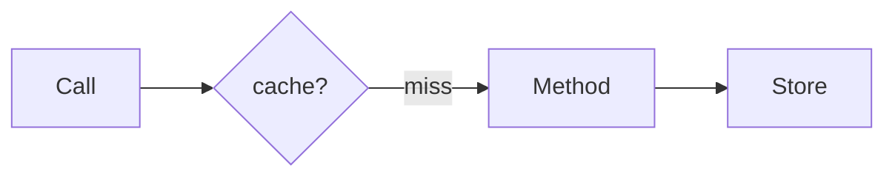

# Spring caching

Spring · 15 min

@Cacheable is cache-aside with a key you must design. The cache is not the database.

## Flow



## Spring caching

The key is the bucket id, not the whole object graph. TTL lives in the cache manager, Redis in this project. Evict on write with @CacheEvict. A cache on a method that is called inside the same class is skipped with the proxy. Do not cache a value that includes a secret. Do not cache a paged query under a key that forgets the page. The distributed-cache design is the reason this annotation exists.

## Play this

1. Name it
2. Say the rule
3. Tie it to the project or a problem
4. One sentence from memory tomorrow

## Steps

- Read the rule once.
- Write the example from a blank file.
- Say the interview answer out loud.

## Example

```text
@Cacheable(cacheNames = "buckets", key = "#id")
Bucket get(String id)
```

## The usual miss

Caching a method and forgetting to evict on update.

## They will ask

What is the cache key for bucket metadata?

## Before you close the laptop

Write the key and the TTL. 60 seconds is a fine assumption if you say it.
