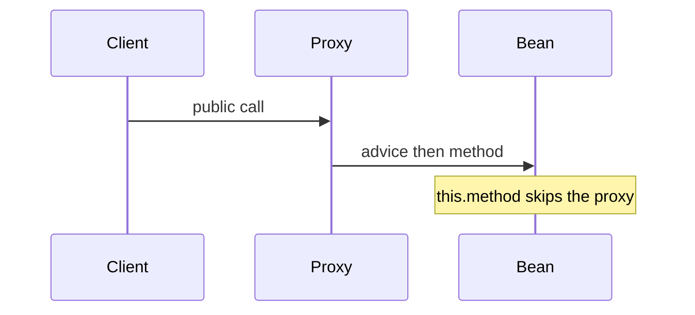

# IoC, beans, and the proxy

Spring · 30 min

Spring creates the objects and injects them. Transactions, security, and async work through proxies. If you call a proxied method from inside the same class, the proxy is skipped.

## Flow



## Play this

1. Container builds the bean
2. Proxy wraps cross-cutting work
3. Self-invocation skips it
4. Constructor injection is the default

## Steps

- Prefer constructor injection. The bean is immutable and tests can pass fakes.
- Bean lifecycle in one breath: construct, inject, aware callbacks, init, use, destroy.
- Auto-configuration is conditional beans. You override them by declaring your own.

## Example

```text
@Transactional on a private method or a self-call does nothing useful.
```

## The usual miss

Field injection because it is fewer lines.

## They will ask

Why did this @Transactional not roll back?

## Before you close the laptop

Point at one service in your Dell work and say which calls go through the proxy.
