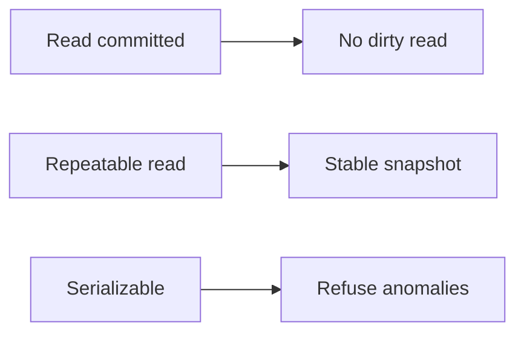

# Isolation

Spring · 20 min

Isolation is which anomalies you accept between concurrent transactions.

## Flow



## Isolation

Read committed is the Postgres default. You do not see another transaction's uncommitted rows. You can see a row that was committed after you started, which is a phantom or a non-repeatable read depending on the shape. Repeatable read keeps a snapshot. Serializable refuses the anomalies and may fail your transaction. You retry. Lost updates are solved with a version or a lock, not by hoping the default is enough. Say the anomaly, then the level. Do not recite the SQL standard from memory if you cannot name the anomaly.

## Play this

1. Name it
2. Say the rule
3. Tie it to the project or a problem
4. One sentence from memory tomorrow

## Steps

- Read the rule once.
- Write the example from a blank file.
- Say the interview answer out loud.

## Example

```text
@Transactional(isolation = Isolation.REPEATABLE_READ)
```

## The usual miss

Raising isolation to hide a missing constraint.

## They will ask

Two transactions read a balance and both write. What is that called?

## Before you close the laptop

Name the anomaly, then version or lock.
