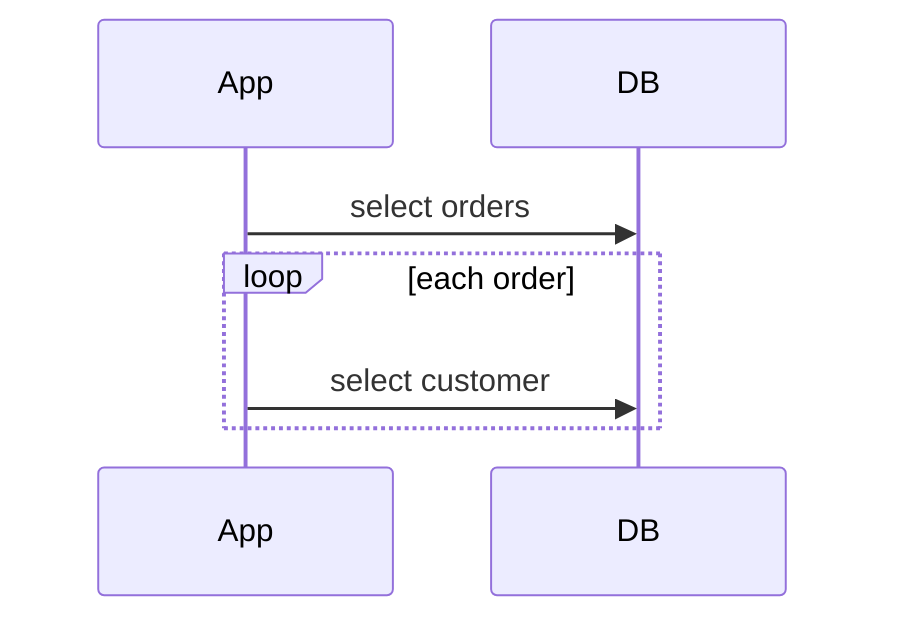

# JPA, N+1, locking

Spring · 35 min

Hibernate will happily issue a query per row. You should notice it before production does.

## Flow



## The queries you did not write

A lazy list inside a loop issues one select per parent. That is N+1. Fix it with a fetch join or a batch. Eager on everything loads the graph. Optimistic locking throws on a version mismatch. Pessimistic locking holds the row. Open-session-in-view hides the N+1 until serialization. Turn SQL logging on for the test and count the selects.

## Play this

1. One query becomes N
2. Fetch join or batch
3. Lazy is a loaded graph
4. Version column for optimistic lock

## Steps

- N+1 shows up when you touch a lazy association in a loop.
- Optimistic lock: a version column, conflict becomes an exception, the client retries. Pessimistic lock holds a database lock. Use it rarely.
- Eager everything is not the fix. You load the graph you need for this request.

## Example

```text
@Version on the aggregate that two agents might update.
```

## The usual miss

Open-session-in-view hiding the N+1 until a loader disappears.

## They will ask

How do you detect N+1 locally?

## Before you close the laptop

Turn on SQL logging for one repository test and count the selects.
