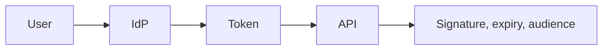

# JWT and OAuth

Spring · 25 min

OAuth is how a token is issued. JWT is a format you verify. The resource server does not collect a password.

## Flow



## JWT and OAuth

A JWT is header, payload, signature. You check the signature with the issuer's key, then exp, iss, and aud. The payload is readable. Do not put a secret in it. OAuth authorization code is the flow for a user. Client credentials is the flow for the agent service. Scopes limit the tool. The safe executor's human approval is not a substitute for a scope. A token on a log line is a leak. Spring Security's resource server filter is the place you configure this, not a hand-rolled parser.

## Play this

1. Name it
2. Say the rule
3. Tie it to the project or a problem
4. One sentence from memory tomorrow

## Steps

- Read the rule once.
- Write the example from a blank file.
- Say the interview answer out loud.

## Example

```text
Authorization: Bearer eyJ...
aud must be this API
exp must be in the future
```

## The usual miss

Decoding the payload and skipping the signature.

## They will ask

What do you check before you trust the subject?

## Before you close the laptop

List signature, expiry, audience on a card.
