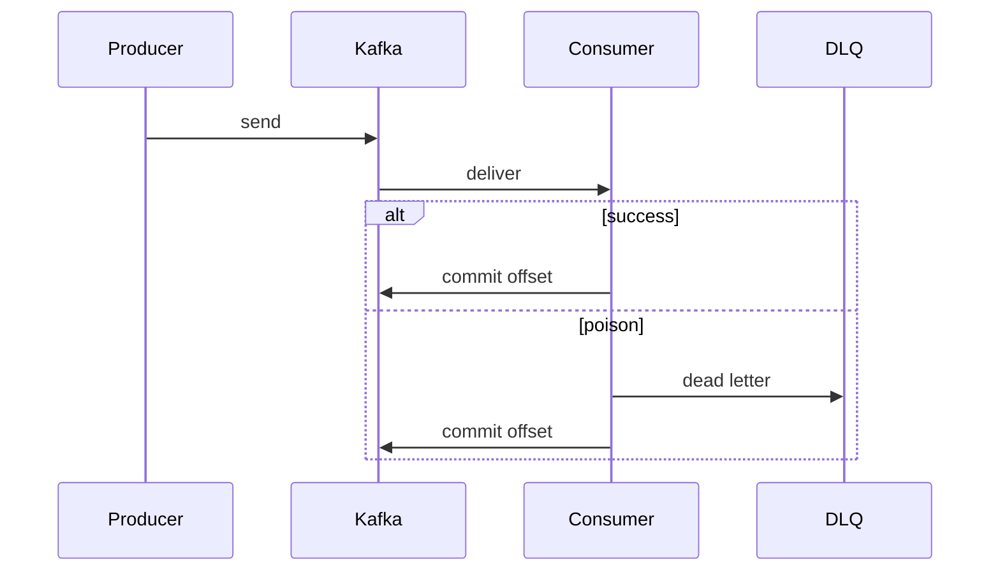

# Consumer crash, duplicates, retries, DLQ

Spring · 40 min

This is the senior part of your Kafka story. Delivery, crashes, and duplicates are one design.

## Flow



## The crash

The consumer writes the database, then crashes before commit. The message is delivered again. The handler sees the idempotency key and skips. That is at-least-once. Committing before the work loses the message. A poison payload goes to a dead-letter topic after a small number of tries. A down dependency uses backoff, not an infinite loop. Offset order is the order you commit, so do not commit a later offset and skip a failed earlier one unless you have recorded the skip.

## Play this

1. At least once is the default
2. Crash before commit redelivers
3. Handler is idempotent
4. Poison goes to DLQ

## Steps

- If the process dies after the side effect and before the offset commit, the message comes back. Your handler must tolerate that.
- Idempotency key on the event. The second delivery finds the row and returns.
- Retries with backoff for a down dependency. A DLQ when the payload itself is bad. Do not retry forever.

## Example

```text
Store processed event ids. On duplicate, ack and skip.
```

## The usual miss

Committing the offset before the work, then losing the crash window's events.

## They will ask

The consumer dies after writing the database and before commit. What do you do?

## Before you close the laptop

Add an idempotency key to the project event on paper. Three lines.
