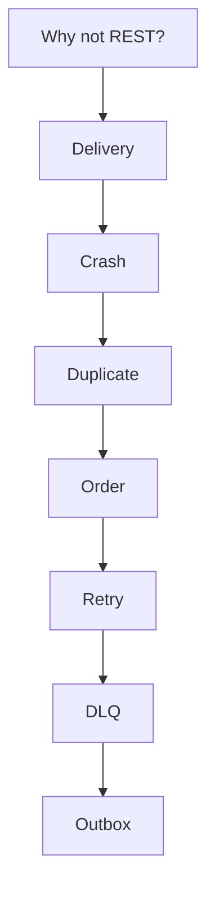

# The Kafka questions, in order

Spring · 30 min

The senior answer is the failure, not the dependency name.

## Flow



## The Kafka questions, in order

Why Kafka instead of REST: more than one consumer, a buffer, or replay. Delivery: at-least-once is the default you design for. Consumer crash after the write and before the commit: the message returns. Duplicate: the handler stores the event id and skips. Ordering: per partition, key by bucket id. Retry: backoff for a down dependency. DLQ: a poison payload after a few tries. Outbox: the database row and the intent to send commit together. Say them as one story. The project is that story.

## Play this

1. Name it
2. Say the rule
3. Tie it to the project or a problem
4. One sentence from memory tomorrow

## Steps

- Read the rule once.
- Write the example from a blank file.
- Say the interview answer out loud.

## Example

```text
key = bucketId
idempotency = eventId
poison -> DLQ
business row + outbox row = one commit
```

## The usual miss

Answering 'we used Kafka for scale' and stopping.

## They will ask

Walk crash, duplicate, and outbox without notes.

## Before you close the laptop

Speak the eight answers once, out loud.
