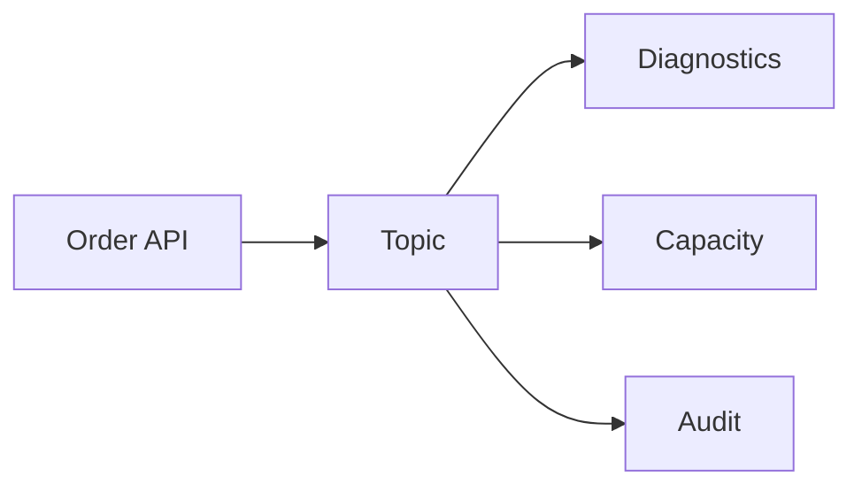

# Why Kafka, not another REST call

Spring · 30 min

REST couples the caller to the callee being up. A log of events lets the diagnostics agent, the capacity agent, and the audit trail each consume at their own speed.

## Flow



## The decision

Use Kafka when several consumers need the same fact, when a slow consumer must not stop the writer, or when you may replay. Use REST when the caller needs the answer in this request. Ordering is per key. The key is bucket id if one bucket's events must stay ordered. Retention lets the RCA agent read yesterday. A topic is not a command bus for a synchronous user click.

## Play this

1. Producer commits the fact
2. Consumers are independent
3. Replay is possible
4. REST was the wrong coupling

## Steps

- Use Kafka when more than one downstream cares, when you need a buffer, or when you must replay.
- Do not use Kafka for a request that needs the answer in the same HTTP call.
- Ordering is per partition key. Choose the key on purpose, such as bucket id.

## Example

```text
Key = bucketId so one bucket's events stay ordered.
```

## The usual miss

A topic with a random key and a later complaint that events arrived out of order.

## They will ask

Why not just call the agent over HTTP?

## Before you close the laptop

Name one Dell flow that is a fact other systems observe, and one that must stay a request.
