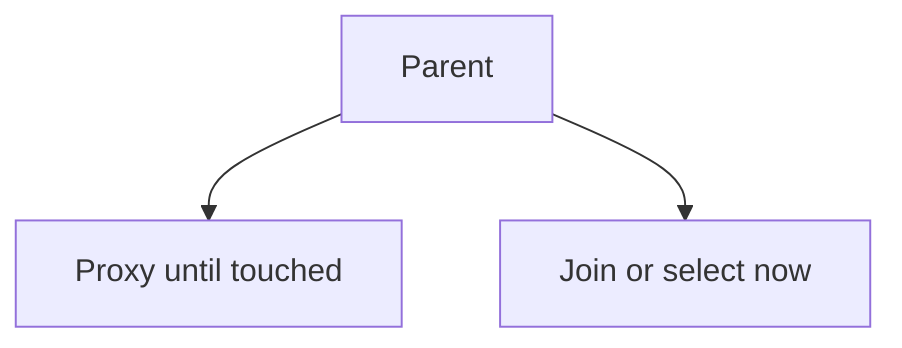

# Lazy and eager

Spring · 15 min

Lazy loads on touch. Eager loads with the parent. Both can be wrong.

## Flow



## Lazy and eager

The default for a many relationship is lazy. Touching it outside a session throws LazyInitializationException, which is information: you loaded too late. Open-session-in-view hides that until the view. Eager on every association loads a graph you did not ask for. Fetch join in the query you care about is the explicit choice. Say the query, not the annotation on the field, when the page is hot.

## Play this

1. Name it
2. Say the rule
3. Tie it to the project or a problem
4. One sentence from memory tomorrow

## Steps

- Read the rule once.
- Write the example from a blank file.
- Say the interview answer out loud.

## Example

```text
@Query("select b from Bucket b join fetch b.objects where b.id = :id")
```

## The usual miss

eager on every list because of one exception in development.

## They will ask

When do you get LazyInitializationException?

## Before you close the laptop

Name the one association you would fetch join.
