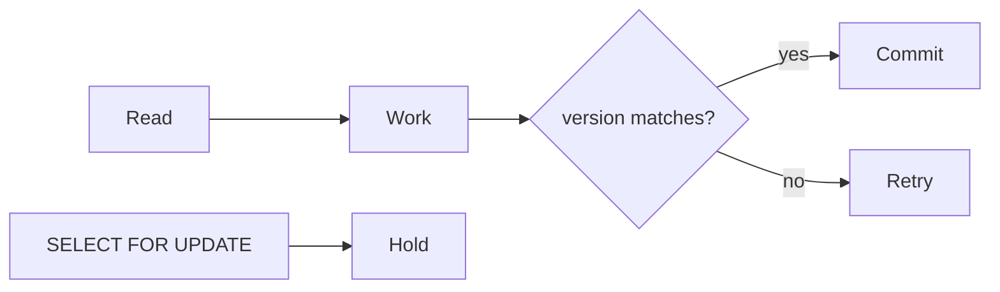

# Optimistic and pessimistic locking

Spring · 20 min

Optimistic checks a version at the end. Pessimistic holds the row from the start.

## Flow



## Optimistic and pessimistic locking

Optimistic: @Version. Two agents read version 3. The first commit makes it 4. The second gets ObjectOptimisticLockingFailureException and retries. Use it when conflicts are rare. Pessimistic: a lock on the row so the second transaction waits. Use it when the conflict is likely and the critical section is short, such as allocating the last unit of capacity. Waiting too long holds connections. A retry needs a bound. The safe executor's pending proposal is a versioned row.

## Play this

1. Name it
2. Say the rule
3. Tie it to the project or a problem
4. One sentence from memory tomorrow

## Steps

- Read the rule once.
- Write the example from a blank file.
- Say the interview answer out loud.

## Example

```text
@Version long version;
```

## The usual miss

Catching the optimistic failure and ignoring it.

## They will ask

Two approvals for one proposal. Which lock?

## Before you close the laptop

Put a version on the proposal row on paper.
