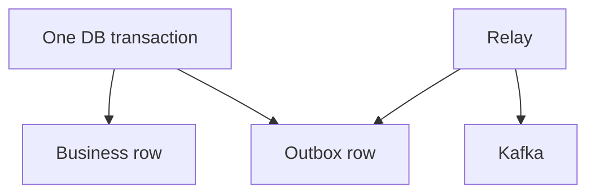

# Outbox

Spring · 25 min

You cannot commit a database row and a Kafka send as one transaction without a pattern. The outbox is that pattern.

## Flow



## Play this

1. Same transaction
2. Relay reads the outbox
3. Mark sent
4. Kafka is outside the transaction

## Steps

- Insert the business row and the outbox row together.
- A worker publishes and then marks the outbox sent. If it crashes, it publishes again. Consumers stay idempotent.
- This is the story that connects your order API and your agents.

## Example

```text
outbox(event_id, type, payload, sent_at)
```

## The usual miss

Publishing to Kafka inside the transaction and hoping both commit.

## They will ask

What is atomic in the outbox pattern, and what is not?

## Before you close the laptop

Sketch the table and the worker loop in the flagship README.
