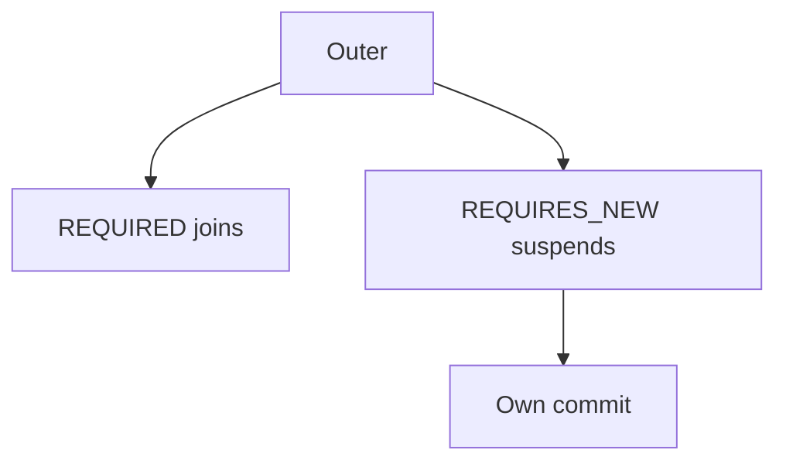

# Transaction propagation

Spring · 25 min

Propagation answers whether this method joins the transaction it was called from.

## Flow



## Transaction propagation

REQUIRED is the default: join, or start. REQUIRES_NEW suspends the outer transaction and commits on its own. A failure there does not roll back the outer work unless the outer sees the exception and is itself marked rollback. NOT_SUPPORTED runs without a transaction. NESTED uses a savepoint and is easy to misuse on Postgres. Self-invocation skips the proxy, so the annotation is ignored. The outbox write must be REQUIRED on the same transaction as the business row. The relay that publishes can be a different transaction.

## Play this

1. Name it
2. Say the rule
3. Tie it to the project or a problem
4. One sentence from memory tomorrow

## Steps

- Read the rule once.
- Write the example from a blank file.
- Say the interview answer out loud.

## Example

```text
@Transactional(propagation = Propagation.REQUIRES_NEW)
void audit(String line) { /* commits even if the caller rolls back */ }
```

## The usual miss

REQUIRES_NEW on the outbox insert, so the event exists without the business row.

## They will ask

The inner method throws. Does the outer row remain?

## Before you close the laptop

Say REQUIRED for the outbox and why.
